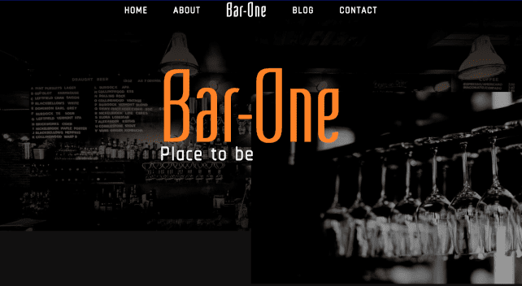

# Hello! I'm Dean

I’m a Toronto Front End Web Developer with a unique background in food & beverage manufacturing. My journey has been an exciting blend of culinary arts and tech innovation, resulting in a distinctive, yet vast, skill sets.

What truly distinguishes me is my capacity for refining my skills through relentless self-improvement and an insatiable thirst for acquiring new and exciting abilities.
I thoroughly enjoy finding new and exciting ways to solve daily problems through building applications and pushing my imagination to its limits.  

#### Protfolio

<a href="https://deanlane.ca">Check out my portfolio here!</a>

### Tech Stack

     

### Featured Projects

---

  
  
Flash It!
  <a href="https://github.com/deanglane/dean-lane-flash-it-app">< Repo Code ></a>

  
  
Pokemon Index<a href="https://github.com/JC47-P2-Sabrina-Dean/pokedex-app">< Repo Code ></a>

  

  
  
Bar One - PDF Conversion<a href="https://github.com/deanglane/dean-lane-bar-one">< Repo Code ></a>

    
### Reach out if you feel like a coffee chat.

---

  
    
  
  

 
  Visitor count 
  

